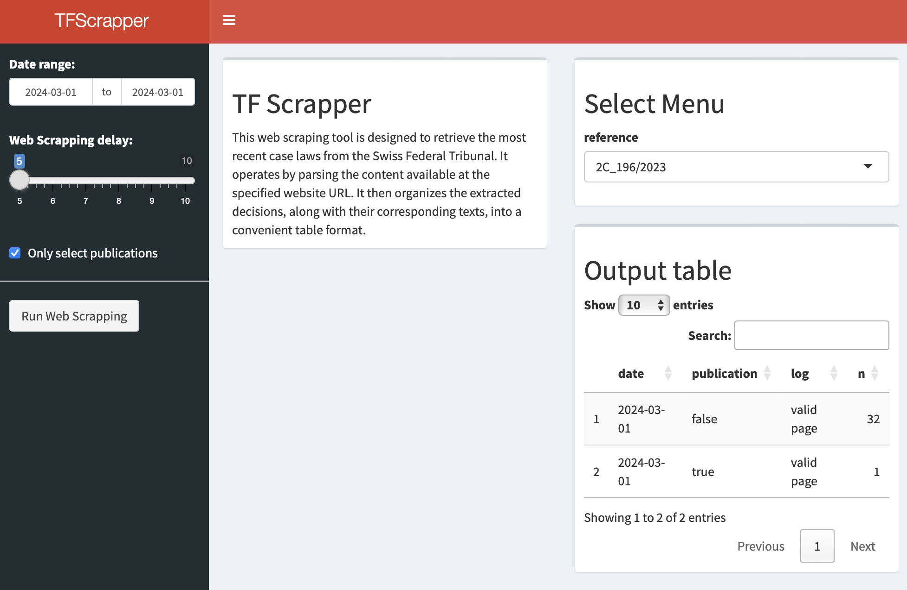

## Web scrapping the Swiss Federal Tribunal case laws using R

This web scraping tool is designed to retrieve the most recent case laws from the Swiss Federal Tribunal. It operates by parsing the content available at the specified website URL: https://www.bger.ch/ext/eurospider/live/fr/php/aza/http/index_aza.php?lang=fr&mode=index&search=false. It then organizes the extracted decisions, along with their corresponding texts, into a convenient table format.

## Preview

Link for an interactive version:   [TFScrapper](https://andres-am.shinyapps.io/TFScrappeR/)

## Dependencies

This project relies on the following R packages:

- dplyr: for data manipulation
- rvest: for web scraping
- polite: for responsible web scraping 
- purr: for automating processes

## How to run it 

Execute the complete TF_webscrapping.R script to fetch the most recent case laws from the Swiss Federal Tribunal and generate the corresponding table.
The input parameters are: 

- home_page: by default the home page is "https://www.bger.ch/ext/eurospider/live/fr/php/aza/http/index_aza.php?lang=fr&mode=index" and refers to home page of the list of latest decisions.
- delay: by default this value is set to 5 seconds and refers to the time to wait when scraping a web page.
- mc.cores: by default this value is set to 8 cores and refers to numbers of cores of your computer to use. The function pbmclapply is specific to UNIX system only, replace with parLapply for windows systems.
- date_start and date_end: refer to the interval between which to retrieve the decision, please be aware that retrieving a month of decision can take around 15 minutes.
